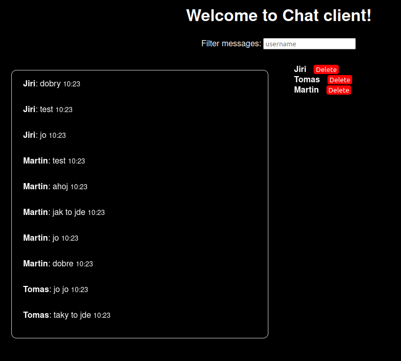

# Chat client & server

## Contents
1. [Server](#server)
2. [Client](#client)
3. [Running a server and client](#running-a-server-and-client)
4. [Web client](#web-client)

# Server

Chat server is simply a TCP server that accepts connections from clients and broadcasts messages to all connected clients. 

In order to connect to server, client needs to authenticate with a username and password. More detail are in [client](#client) section.

### Database
Server is connected to a postgres database. It uses sqlx to connect to the database and store messages and users. It doesn't store files and images transfered between clients.
The easiest way to startup a postgres database is to run a script `./scripts/init_db.sh`. It will start a docker container with postgres database and runs migrations to create tables.
To run just the migrations, run `SKIP_DOCKER=true ./scripts/init_db.sh`. 

### Configuration
Configuration of the server is done through configuration files in `./configuration/base.yaml` and `./configuration/local.yaml`.
It is possible to start a server on a different port or setup a different database connection.

### API
Server exposes an API to get all messages and users. It is used by the web client to display all messages and filter them by username.
The API is build with Actix-web and by default it runs on `0.0.0.0:11112` because of running Prometheus in docker. It can be changed in the configuration files.

List of all endpoints:
```
GET /health - health check
GET /messages?username={username} - get all messages, optionally filter by username
GET /users - get all users
DELETE /user/{id} - delete user and all his messages
GET /metrics - get metrics for Prometheus
```

### Tracing
When running a server, debug tracing logs are sent to the standard output.

### Metrics
Server exposes metrics for Prometheus on `/metrics` endpoint. It is tracking number of connected users and number of messages sent (including messages that are sent by server e.g. `new user connected`).
Prometheus is collecting the metrics every 5 seconds. This can be changed in the `prometheus.yml` file.

Details of metrics:
```
# HELP active_connections_counter How many clients are connected to the server
# TYPE active_connections_counter gauge
active_connections_counter 0
# HELP messages_counter How many messages were sent to clients
# TYPE messages_counter counter
messages_counter 5
```

To run Prometheus and Grafana, run the following commands after starting the server:
```
$ docker compose up
```

### Running a server
Because of the configuration files located in the server directory, you need to `cd` to the s./server before running it.

```
$ cd ./server
$ ./scripts/init_db.sh
$ cargo run --bin server
```


# Client

Chat client is a TCP client that connects to a server. It allows users to send text messages, images and files to other connected clients.

### Authentication
When client is started, it connects to the server on a given host and port. It then asks for a username and password to authenticate with the server.
If the user with a given username doesn't exist, it is created and user can login in the future. If the user exists, the password is verified agains the stored hash and
response is sent back to the client. Just follow the messages in the standard output.

If you enter an incorrect password, you need to enter username and password again.
```
Login failed, incorrect password.
Please try to log in again.
Enter your username.
```


### Sending messages
Once user is authenticated, it can send messages to other connected clients.
Text messages does not require any special commands and are sent as they are.

#### Commands
```
.file <FILE_PATH>       Send a file to other connected clients. The file is saved to the directory specified by `--output-dir` argument. If the file already exists, it is overwritten.
.image <IMAGE_PATH>     Send an image to other connected clients. If image is not in a .png format, it is converted to .png.
.quit                   Disconnect from the server and exit the client.
```
### Tracing
When client is started, debug tracing logs are saved to `./logs` directory. The output can be changed with argument `--logs-dir <LOGS_DIR>`.

### Running a client

```
$ cargo run --bin client 
```

Client can be started with these optional arguments:

```
Options:
      --host <HOST>                         Server Host [default: 127.0.0.1]
  -p, --port <PORT>                         Server Port [default: 11111]
  -o, --output-dir <OUTPUT_DIR>             Directory to save incoming files and images [default: ./data]
  -l, --logs-dir <LOGS_DIR>                 Directory to save tracing logs from client [default: ./logs]
  -u, --username <USERNAME>                 Username [default: anonymous]
  -h, --help                                Print help
  ```

# Running a server and client

Once you have a server and multiple clients running, you can send messages between them.
Typical logs from client looks like:

```
Connecting to server on 127.0.0.1:11111...
Enter your username.
Jiri
Enter your password. If you haven't registered yet, you will be registered with this username and password.
mysecretpassword
You were successfully registered.
Connected. You can now send messages.
--      Active users: 0      --
--      New user connected: Tomas      --
Ahoj Tome
Tomas: Ahoj, jak se mas?
dobre
.quit
```

Logs from server:
```
{"v":0,"name":"server","msg":"Starting server on address 127.0.0.1:11111...","level":30,"hostname":"jiri-lenovo","pid":276418,"time":"2023-12-04T20:16:46.540640924Z","target":"server","line":49,"file":"server/src/main.rs"}
{"v":0,"name":"server","msg":"New connection from: 127.0.0.1:51322. Authenticating...","level":30,"hostname":"jiri-lenovo","pid":276809,"time":"2023-12-04T20:17:48.242551504Z","target":"server","line":90,"file":"server/src/main.rs"}
{"v":0,"name":"server","msg":"Received log in message from user.","level":20,"hostname":"jiri-lenovo","pid":276809,"time":"2023-12-04T20:18:02.281027184Z","target":"server","line":276,"file":"server/src/main.rs"}
{"v":0,"name":"server","msg":"[GET_USER - START]","level":30,"hostname":"jiri-lenovo","pid":276809,"time":"2023-12-04T20:18:02.281203678Z","target":"server","line":236,"file":"server/src/main.rs","username":"Jiri"}
{"v":0,"name":"server","msg":"[GET_USER - EVENT] Failed to execute query: RowNotFound","level":50,"hostname":"jiri-lenovo","pid":276809,"time":"2023-12-04T20:18:02.360897854Z","target":"server","line":246,"file":"server/src/main.rs","username":"Jiri"}
{"v":0,"name":"server","msg":"[GET_USER - END]","level":30,"hostname":"jiri-lenovo","pid":276809,"time":"2023-12-04T20:18:02.360968815Z","target":"server","line":236,"file":"server/src/main.rs","elapsed_milliseconds":79,"username":"Jiri"}
{"v":0,"name":"server","msg":"Registering new user.","level":20,"hostname":"jiri-lenovo","pid":276809,"time":"2023-12-04T20:18:02.36101561Z","target":"server","line":313,"file":"server/src/main.rs"}
...
```

## Exploring the database tables and stored data
User can attach shell to the running postgres container by running

```
$ docker exec -it container-postgresdb /bin/sh
```
Once inside the container, you can connect to the database with `psql` command. 
```
psql -U postgres -d chat_server_db
```
To display all tables, run
```
\dt
```
Output:
```
             List of relations
 Schema |       Name       | Type  |  Owner   
--------+------------------+-------+----------
 public | _sqlx_migrations | table | postgres
 public | messages         | table | postgres
 public | users            | table | postgres
(3 rows)
```
```
SELECT * FROM messages;
```
Output:
```
                  id                  |               user_id                |    data    |           timestamp           
--------------------------------------+--------------------------------------+------------+-------------------------------
 b54ae39a-4a29-4045-b29c-aab8d5713290 | 7fc3bf50-1d97-4d6e-9fb3-eb0e9642afb6 | ahoj       | 2023-12-04 20:33:00.413852+00
 ddfb756b-3dfc-45bd-aec9-d34b352784cf | 7fc3bf50-1d97-4d6e-9fb3-eb0e9642afb6 | jak se mas | 2023-12-04 20:33:05.973267+00
 00fb6924-d69d-476b-ac45-0f6b5df06c19 | 695121c7-3459-46fa-a4a7-4601812f1f62 | dobre      | 2023-12-04 20:33:10.629031+00
(3 rows)
```

# Web client

Web client is a simple web application written in svelte. It allows users to see all messages, filter them by username and delete user and all his messages.
The client gets data from server's API, thus it needs to be running.

On the background, the web client periodically gets new messages from the server and updates the UI. The same for newly connected users.
When new messages appear in the list, the list scrolls to the bottom to display the latest messages.

There is no authentication in place, hence any user can display everything and also delete all users.

To run the web client, run the following commands:
```
$ cd ./web-client
$ npm install
$ npm run dev -- --open
```

